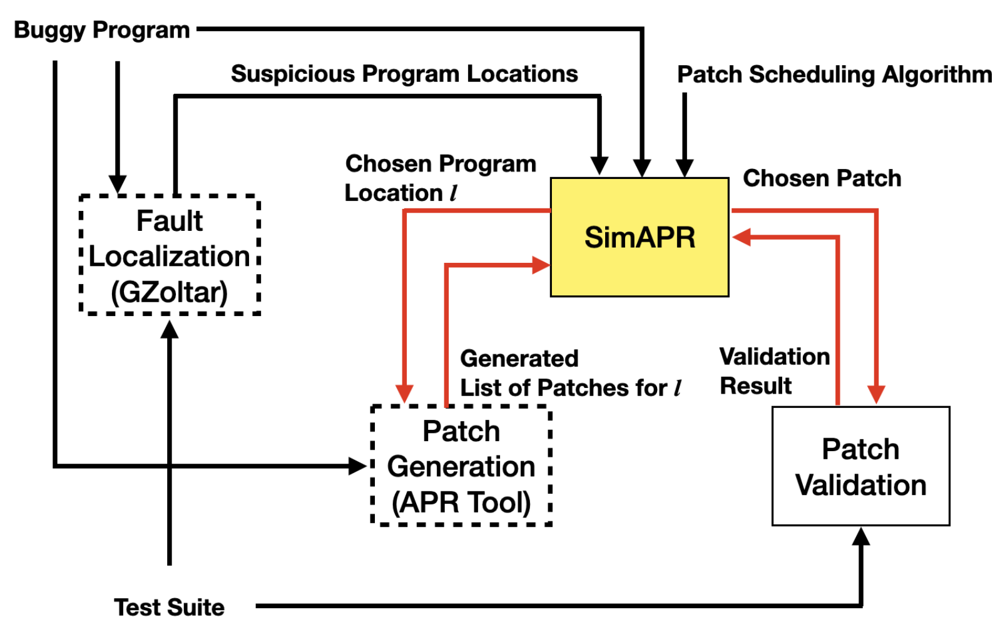

# SimAPR
SimAPR is patch scheduling framework for patch searching problem.
It supports sequential algorithm from original APR tools, SeAPR, GenProg family algoritm and Casino.

## About this repository

Figure: Overview of SimAPR

This repository contains (1) implementation of SimAPR, (2) modified APR tools to generate patch space and (3) scripts to reproduce our experiments. 

Implementation of SimAPR is in [SimAPR](./SimAPR/). Detailed descriptions are also in this directory.

Our scripts are prepared in [experiments](./experiments/). Detailed descriptions include how to run the scripts are also in this directory.

We prepared 6 APR tools to run SimAPR: `TBar`, `Avatar`, `kPar` and `Fixminer` as template-based APR and `AlphaRepair` and `Recoder` as learning-based APR.

Note: We already run GZoltar v1.7.3 and put every FL results in this repository.

Note: in our implementation, we provide every locations to APR tool before running SimAPR and APR tool generates every patch candidates for every location.

## Getting Started
This section describes how to run SimAPR in docker container.
If you want to reproduce our experiments, we already prepared scripts to reproduce our experiments easily.
Please see [Detailed Instruction](#detailed-instruction).

To run SimAPR, you should follow these steps:
1. Build docker image and create container
2. Generate patch space via running APR tools modified by us
3. Run SimAPR

In this section, we will describe how to run SimAPR with TBar and Closure-62 benchmark.
If you want to run different APR tools and version, change the `tbar` and `TBar` to proper APR tool and `Closure_62` to proper version.

### 1. Build docker image and create container
First, clone our repository:
```
$ git clone https://github.com/FreddyYJ/SimAPR.git
$ cd SimAPR
```

To build docker image, run the following command:
```
$ cd dockerfile
$ docker build -t simapr:1.2 -f D4J-1.2-Dockerfile ..
```

After that, create container with the following command:
```
$ docker run -d --name simapr-1.2 -p 1001:22 simapr:1.2
```

Next, access to the container with the following command:
```
$ ssh -p 1001 root@localhost
```

### 2. Generate patch spaces via running APR tools
Before you run SimAPR, every patch space and patch candidates should be created. To do that, run the following command:
```
$ cd SimAPR/experiments/tbar
$ python3 tbar.py Closure_62
```

This will take about 2-3 minutes.

Generated patch space is stored in `~/SimAPR/TBar/d4j/Closure_62`.
Meta-information of patch space is stored in `~/SimAPR/TBar/d4j/Closure_62/switch-info.json`.

### 3. Run SimAPR engine
After generating patch space, run SimAPR. To do that, run the following command:
```
python3 ~/SimAPR/SimAPR/simapr.py -o ~/SimAPR/experiments/tbar/result/Closure_62-out -m <orig/casino/seapr/genprog> -k template -w ~/SimAPR/TBar/d4j/Closure_62 -t 180000 --use-simulation-mode ~/SimAPR/experiments/tbar/result/cache/Closure_62-cache.json -T 1200 -- python3 ~/SimAPR/SimAPR/script/d4j_run_test.py ~/SimAPR/TBar/buggy
```

SimAPR provides various scheduling algorithms: original, Casino, SeAPR and GenProg.
Original algorithm follows the sequence generated by the original APR tool.
Set `-m` option as proper scheduling algorithm.

This command sets overall timeout as 20 minutes (It will take slightly more than 20 minutes).
If you want to set timeout for each patch candidate, set `-T` option in seconds.

### The outputs
The outputs of SimAPR are stored in `~/SimAPR/experiments/tbar/result/Closure_62-out`.
This directory contains three files: `simapr-finished.txt`, `simapr-result.json` and `simapr-search.log`.
#### simapr-finished.txt
`simapr-finished.txt` is generated after SimAPR finishes.
It contains overall time information.
* `Running time` is overall time.
* `Select time` is the time to select patch candidates. This time is an overhead from each scheduling algorithm.
* `Test time` is the time to execute test cases for each patch candidate.

Note that `select time` for original algorithm is 0 because original algorithm does not use dynamic scheduling.

#### simapr-result.json
`simapr-result.json` contains the results of each patch candidate in JSON format.
It is a JSON array that contains each result of patch candidates.

Each result contains these information:
* `execution`: Actual test execution. We will describe this later.
* `iteration`: The number of iteration. It will increment by each result.
* `time`: Overall time until this result in second.
* `result`: True if the patch passes at least one failing test. False if the patch fails all failing tests.
* `pass_result`: True if the patch passes all test cases (valid patch).
* `pass_all_neg_test`: True if the patch passes all failing test cases.
* `compilable`: True if the patch is compilable.
* `total_searched`: # of tried patch candidates. It may same with `iteration`.
* `total_passed`: # of patch candidates whose `result` is true.
* `total_plausible`: # of patch candidates whose `pass_result` is true. (# of valid patches)
* `config`: Patch ID.

### About simulation mode
SimAPR provides simulation mode to reduce the overall time.
After SimAPR finished, cached results are stored in `~/SimAPR/experiments/tbar/result/cache/Closure_62-cache.json` in JSON format.
It is a JSON object that its key is patch ID and its value is the result of test execution.

Each cached result contains these information:
* `basic`: True if the patch passes at least one failing test. False if the patch fails all failing tests. Same as `result` in `simapr-result.json`.
* `plausible`: True if the patch passes all test cases (valid patch). Same as `pass_result` in `simapr-result.json`.
* `pass_all_fail`: True if the patch passes all failing test cases. Same as `pass_all_neg_test` in `simapr-result.json`.
* `compilable`: True if the patch is compilable. Same as `compilable` in `simapr-result.json`.
* `fail_time`: The time to execute failing tests.
* `pass_time`: The time to execute passing tests.

Note that `pass_time` is 0 if the patch fails failing tests.

If selected patch candidate is already cached, SimAPR does not execute test cases and use cached result.
Therefore, `execution` in `simapr-result.json` is not incremented.

## Detailed Instruction
Detailed instructions are in [README_detailed.md](./README_detailed.md).